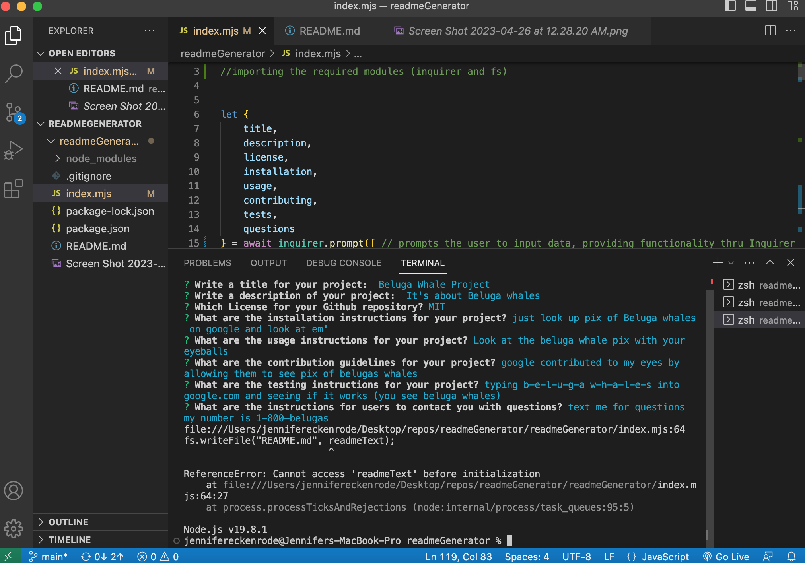

# README.md File Generator


## Description


## Table of Contents

- [Installation](#installation)
- [Usage](#usage)
- [Contributing](#contributing)
- [Tests](#tests)
- [Questions](#questions)


## Installation

In order to generate your own README.md file through the command-line, you will need to follow these steps to get your program running in the correct environment:

- Navigate to your local command line/terminal window, and change directories into the directory where you want to create a new repository.

```cd repos```

- Next, create a new directory called readmeGenerator using the command 

```mkdir readmeGenerator```

- Once directory is created, you’ll want to change directories into it

```cd readmeGenerator```

- Open directory into Visual Studio code by entering into the command line:

```code .```

- Once VS code has opened with the 'readmeGenerator' directory, open the integrated terminal associated with it, and in the command line type ```npm init -y``` ,which is used to initialize a new Node.js project with default settings.
 
- When you run ```npm init -y```, NPM creates a new package.json file in your current directory with default settings, including the project name, version number, description, entry point file, test command, and other metadata.

- Next, create a '.gitignore' file in the directory in order to store the ‘node_modules’ directory into. The purpose of ‘ignoring’ the node_modules is to reduce the repository size, because if you include it in your Git repository it can increase the repository's size significantly. This can make it slow to clone, push, or pull the repository.

- Once we’ve initialized the Node.js, we will install Inquirer with the command ```npm install inquirer@8.2.4```. Inquirer is a powerful and easy-to-use Node.js library for creating interactive command-line interfaces (CLIs)

- When the installation process is complete, we can implement Inquirer into our README generator project by ‘importing’ it at the top of our Javascript file (which reads the code TOP to BOTTOM), ‘import inquirer from 'inquirer’;’

- Lastly, we will create a 'index.mjs' file into the integrated terminal with the command ```touch index.mjs```. In Node.js, when you import a directory that doesn't have an 'index.js' file, Node.js looks for an 'index.mjs' file by default. The 'index.mjs' file imports two modules from other files in the same directory, and then exports them as an object with named properties. This allows other modules to import all the modules in the directory at once by importing the 'index.mjs' file.

- Once the index.mjs file is created, you will complete the process by running ```node index.mjs``` into the command line. 
This starts the Node.js runtime, and executes the JavaScript code in the 'index.mjs' file as a module.

Now we're ready to start coding!

## Usage


## License [](https://opensource.org/licenses/MIT)

This project is licensed under the terms of the MIT license.


## Contributing

To contribute to the project: 

1. start by forking the repository and creating a new branch specifically for your new feature or bug fix.
2. It's important to adhere to the project's coding standards and properly format your code.
3. When committing changes, be sure to write clear and concise messages that describe the changes made.
4. If your contribution affects the user interface or experience, include screenshots or animated GIFs in your pull request to help reviewers understand the changes. 
5. Additionally, make sure your code is thoroughly tested and all existing tests pass before submitting the pull request.
6. Finally, provide a detailed description of your changes and explain why they're necessary.

Thanks for contributing! 


## Tests

To ensure that my README generator was functioning properly, I used Node.js to runtests on my generator application. These tests allowed me to check that my functions were correctly applying user input into the README.md file thus generating a quality, professional README.md file with all the necessary sections. By using Node.js to run these tests, I was able to catch any potential bugs or errors early on in the development process, ensuring that my final product was functional.

```md 

```

## Questions


